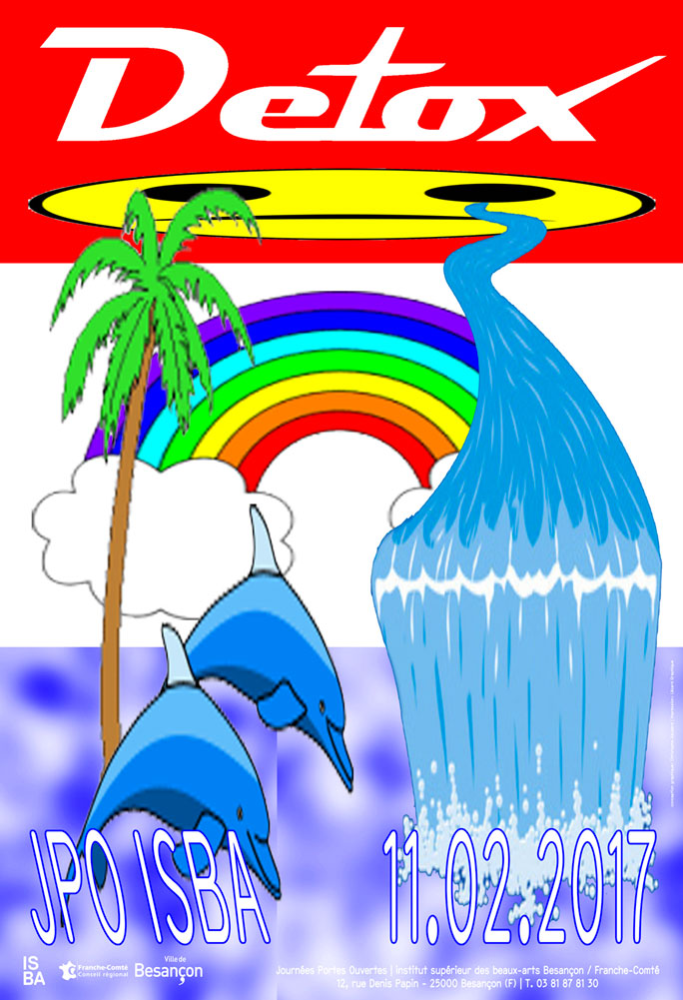

---
title: MATHIAS, CHRISTOPHE & TOUS LES AUTRES
...

À travers l’analyse de deux affiches : 
pour Clavi on the Rocks de Mathias Schweizer et pour les portes ouvertes de l’ISBA par Christophe Gaudard, je m’interrogerai sur le statut du graphisme d’auteur à travers les notions qu’il convoque, ses logiques de production et de monstration. Quelles relations entretient-il avec le contenu iconographique qu’il convoque et manipule et dans quel but ?

 

 *Cette première affiche a été réalisée pour le festival de musique Calvi on the Rocks en 2009. Mathias n’avait jamais vu ce lieu auparavant. Jamais il n’avait posé les pieds en Corse.
Et pourtant. C’est avec des captures d’écran de paysages de cette île trouvés sur internet qu’il décide de répondre à la demande de son commanditaire. Des rochers, des plages, des palmiers, des couchers de soleil. Tout y est. Un paysage de carte postale. On s’y croirait (presque).
*
  Tout d’abord, l’île. Ce microcosme isolé. Ce lieu en que tel est fort en symbolique et support aux mythes. Le mythe est un récit relatant des faits imaginaires non consignés par l’histoire, transmis par la tradition et mettant en scène des êtres représentant symboliquement des forces physiques, des généralités d’ordre philosophique, métaphysique ou social. L’île, du fait qu’elle se trouve coupée du monde en retrait du continent, est un endroit entouré de mystère où l’extraordinaire peut avoir lieu. Robinson Crusoé, Jurassic Park, l’Atlantide ou Shutter Island, navigateurs perdus ou découvreurs d’îles nouvelles, les récits autour de l’île sont foisonnantes. Homère dans *L’Odyssée* développe déjà une réflexion sur l’insularité. Ces textes questionnent en fait la réalité des formes : les iles n’existent pas comme des éléments individuels singuliers mais comme une entité symbolique, à travers la description d’îles telles qu’Ogygie (l’île de Calypso, nombril de la mer), l’île d’Éole (île-bouclier), la Phéacie (seulement évoquée et non décrite comme paysage insulaire). C’est un vision symbolique car elle n’a de valeur que par ce qu’elle exprime, ce qu’elle évoque. La réalité géographique n’a que peu d’importance par rapport à la projection qu’on s’en fait.
  Sylvie Vilatte décrit le rapport de Homère à l’île dans ces textes dans *L’insularité dans la pensée grecque* comme la description d’un réel ensemble symbolique : «La vue d’ensemble de la nature insulaire montre donc que le poète de l’Odyssée décrit moins des individualités insulaires précises qu’une image codifiée pénétrée de symbolisme. En effet le caractère original de chaque île apparait rarement : par exemple relief marqué ou plat, périmètre insulaire étiré en longueur, arrondi ou très découpé, etc…». Cette île composée par Mathias apparaît elle aussi comme une fantasmagorie, dans le sens où elle corresponds à une utopie, une illusion qui n’a rien de réel. C’est une vision hallucinée de la Corse qui n’existe qu’à travers les yeux qui regarde l’affiche. C’est un espace fictif suggéré imposé plutôt que qu’une réalité existante. À l’instar du poète Homère, le graphiste narre une fiction qu’il n’a pas vue ni vécue. 

 *Cette seconde affiche a été réalisée pour les journées portes ouvertes de l’Institut Supérieur des Beaux Arts de Besançon par Christophe Gaudard en 2017. Christophe aime composer les images comme des rébus. Christophe aime les cliparts. Un smiley, un palmier, un arc-en-ciel, une cascade, des dauphins et hop !*
  Ces éléments proviennent aussi d’internet, mais ne sont cette fois-ci pas photographiques mais des images cliparts. Le clipart est un petit dessin ou un symbole, prêt à l’emploi permettant l’illustration des documents. Les bibliothèques de cliparts disponibles en ligne sont libre de droit. Elles sont le plus souvent utilisées par habitude ou automatisme par des personnes non initiées au graphisme et qui n’ont pas le réflexe de questionner leur rapport à l’image. Leur utilisation est simple et instinctive. Ils servent d’illustration à un message et participent à le rendre le ton plus sympathique qu’un texte vu comme informel. Ils cherchent à tisser une complicité entre l’éméteur du message et le receveur. Ils servent à exprimer un ressenti. Et grâce à l’outil informatique et à internet, ce langage codé qui consiste à parler avec des images est à présent accessible à tous. 

  Ils sont ici sortis de leur contexte habituel et élevé au rang d’images et non plus d’images accompagnant et teintant le propos d’un texte. Ils composent l’image à la façon d’un rébus. La cascade part de l’oeil du smiley et se transforme en torrent de larmes, un smiley triste associé avec un arc-en-ciel et des dauphins, les images vont à contre sens les uns des autres. Un lien se tisse entre les différents éléments comme si un sens occulte nous était caché. Le lexique visuel investit donne un aspect trivial à l’affiche. Le visuel est construit sur plusieurs plans. Il transporte ces éléments graphiques dans un autre espace que celui qu’ils sont habitués à occuper, du A4 ou A3 bureautique à l’affiche. Ils servent habituellement d’ornements et compose ici, pour faire l’analogie avec l’affiche de Mathias précédemment vue, un paysage numérique. Comme pour l’affiche de Mathias, l’île paradisiaque est évoquée. L’image ne cherche pas cependant pas à séduire, à emmener le regardeur dans un autre monde.
  À travers celle de Mathias en revanche on peut faire lien avec le registre visuel de la publicité. Outre le montage, les éléments sont modifiés et semblent volontairement faux. L’image du pub, elle aussi ne cherche pas à dépeindre une réalité mais à exciter le désir du regardeur afin de vendre. On peut faire le lien entre cette image et le mythe des sirènes qui ar leurs chants au charme irrésistible, attiraient les marins et les entraînaient à la mort. Elles chantaient, paraît-il, des prophéties et des chansons inspirées par l’Hadès, l’Au-Delà. La publicité peut apparaître comme une litanie visuelle, incessament répétée, qui peu à peu infuse notre inconscient et attirent le désir de consommation.
  Par ailleurs, cette affiche est un montage d’images clichées, de poncifs glanés sur internet : Mathias imagine et construit la projection d’un endroit où il n’est jamais allé. L’image n’est pas ici une trace ou un souvenir de quelque chose qui n’existe plus mais la fantasmagorie d’un espace qui n’a jamais existé. L’image traduit une réalité fausse ou plutôt la projection imaginaire d’une réalité. Cet espace n’existe pas d’autant plus que le lexique utilisé ici, la matière première qui a servi à la construire est issue d’une collecte d’images d’internet. Ces images font partie de la fiction mercantile cherchant à susciter chez le regardeur le désir de s’évader, de sortir de la réalité du quotidien, d’exotisme. 
  Les photographies de la Corse mises en scène par Mathias fonctionnent comme autant d’icônes qui traduisent plus l’idée du voyage qu’une réalité d’un lieu singulier. On peut rapprocher ces images des signes mis en place sur un blason. Le blason, pour reprendre les mots d’Annick Lantenois dans *Le Vertige du Funambule*, est « un texte dont le décryptage nous fait rentrer dans l’épaisseur d’un récit étendu dans la durée de l’histoire du signe lui-même et de ce qu’il représente. [... Les logos] ne portent plus les symboles des traces matérielles. L’histoire est absente, l’enracinement dans la durée s’oublie. » Le blason est donc porteur d’une temporalité qui s’inscrit en terme de siècles et le logo dans dans une forme de présent perpétuel, omniprésent et insaisissable. On peut projeter la photographie et plus précisément l’imagerie mercantile manipulée sur Photoshop comme porteuse de nouveaux repères. «[…] Il existe, dans de nombreuses cultures, des signes visuels qui ont pour fonction de dire l’identité des individus et des groupes, et leur place dans la société. [...] Tous, ou presque, présentent la particularité d’être chargés d’une forte dimension symbolique et de toujours dire plus que ce qu’ils ont pour fonction de dire. » nous dit Michel Pastoureau, dans *Une écriture en images : les armoiries parlantes*. À la différence d’un blason, qui ancre dans le temps des valeurs et un symbolisme fort, il s’agit là à contrario de susciter un désir et par la même générer une frustration, de vendre une expérience à travers un produit quelconque. 
  Christophe, qui lui se trouve plus dans la démarche du logo, assume complètement de montrer le processus de construction de l’image dans sa production. Comme souvent dans son travail, les éléments sont volontairement déformés, étirés horizontalement et verticalement. Certains sont pixellisés : l’effet de mise à distance est bien plus fort encore que sur l’affiche de Calvi on the Rocks, Christophe nous montre toute la matérialité de l’image numérique. Aucune illusion n’est possible. Par ailleurs, on peut penser que ces codes cherchent à singer une forme d’amateurisme de l’image, de part la nature du lexique visuel basique — facilement utilisable par tous — et leur traitement. 

  À contrario, Mathias, comme souvent dans sa pratique, prend une posture de peintre et approche le paysage à la manière d’un impressionniste. Il ne cherche pas à reproduire l’apparence de la réalité. mais plutôt à créer un effet, une expérience par l’affiche. Il y a aussi dans la construction de l’image de cet ailleurs l’aspect dérangeant de la carte postale qui prend des allures d’un no man’s land dégoulinant de couchers de soleil paradisiaques, pour citer Vanina Pinter dans l’article *Format 1 : Oracular Vernacular / MS* sur le site Tombolo. La végétation se perd dans les embruns, la lumière change d’angle d’un plan à l’autre de l’image, un fragment de ciel de jour, un autre de nuit, à moins que ce soit l’inverse… Et comme dans la grande majorité des travaux de Mathias, aucune figure humaine n’est représentée. Seul la ligne d’horizon est certaine. Il en résulte une scène qui nous apparaît comme surréaliste, apocalyptique, à bords perdus cependant, permettant une immersion totale dans ce visuel onirique. De ce principe résulte une fascination et une magie que Mathias se plait à rendre ambiguë, par les éléments de distanciation précédemment cités. Les intentions de l’image ne sont pas claires, il y a un mouvement de recul pris vis-à-vis de ce qui est montré.
  Un sentiment de rejet se fait sentir à la vue de cette affiche car elle convoque un lexique qui pourrait nous apparaitre comme vulgaire, dans le sens de admis, pratiqué par la grande majorité des personnes composant une collectivité, qui est répandu. Ce rapport à des outils accessibles en libre accès et leur déformation à l’extrême se retrouve dans tout le travail de Christophe. Conscient de faire des images pour des graphistes, où des personnes éduquées à lire des images, il en joue. La première fois que j’ai rencontré une image de Christophe, à Chaumont en 2014, et depuis ce moment là, je me suis posé la questions de ses intentions. De qui se moque-t-il ? Des graphistes ? De quelqu’un non informé à la compréhension de l’image ? De lui-même ? De l’institution qu’il représente ? 

   Il y a un doute quant à l’intention de Christophe, le regardeur ne sait de qui l’on se moque. “Pour distinguer si une chose est belle ou ne l’est pas, nous n’en rapportons pas la représentation à son objet au moyen de l’entendement et en vue d’une connaissance, mais au sujet et au sentiment de plaisir ou de déplaisir. […] Le jugement de goût […] est donc esthétique.” nous dit Pierre Bourdieu dans *La distinction, Critique sociale du jugement*. Dans cet ouvrage, il bouleverse les catégories sur le Beau, l’art et la culture, qui n’avaient jamais été remises en question, notamment la vision Kantienne qui considère le Beau comme un sentiment universel. Non seulement le beau n’est pas un concept a priori, mais, au contraire, “les gens ont le goût de leur diplôme” et, les catégories de la distinction dépendent de la position sociale. Le rapport à une image est conditionné par le regard et l’éducation que ce dernier a reçu, si il est informé ou non informé. Le graphiste manipule ici des signes qui sont souvent manipulés et vus par un regard non informé alors qu’il ne l’a plus depuis longtemps. Christophe va ainsi plus loin que Mathias, car il produit un graphisme qui sera exposé au Festival de Chaumont par exemple, mais il réintroduit en plus les signes d’une culture qui n’appartient pas au public qui va venir regarder les travaux présents dans ce type de lieu, car le graphisme d’auteur est admiré par les regards informés. Le regard non informé est exclu de ces festivités car il n’a pas la culture adaptée pour appréhender pleinement l’image, mais peut-on réellement appréhender totalement l’image dont on est pas le graphiste, et de même quand on est graphiste, comment savoir, comment être sûr·e que notre image sera perçue comme on la conçue. 
  L’intention de Mathias avec cette affiche est de nous emmener vers un ailleurs fictif par l’image, de questionner notre rapport à l’image promotionnelle. Le fait qu’elle soit muette et déshumanisée, exposée dans un lieu d’art élève cette décontextualisation au rang d’intention. Ainsi domestiqués, les différentes pièces de son travail deviennent des joyaux difficilement lisibles et à l’impact incertain faute d’être présentés dans leur contexte naturel. L’exposition se livre à une critique acerbe et ironique du système global de communication visuelle dont nous sommes chaque jour les usagers. Grâce à ce procédé qui rends à l’image l’agressivité, le lustré de la référence qu’elle convoque, son détournement la rend irrévérencieuse et offensive.
  L’affiche de Christophe communique sur les portes ouvertes de L’ISBA Besançon. Le mot *DETOX* est lisible sur la première version de l’affiche et *DETOX YOUR MIND* sur la deuxième version. Ces mots, sont dans la première version traités comme un logo mal géré. Ces mots peuvent être perçus comme une injonction à ne pas suivre une formation dans une école d’art. À se détoxifier du formatage dû à ces formations ou une incitation à produire en dehors de ce cadre. À quoi servirait une école d’art si on peut faire des affiches en autodidacte. Christophe parle donc d’une manière d’apprendre et fait une critique de l’institution artistique.

  De part ce rapport à la peinture et sa condition d’objet graphique, ces affiches entretiennent une ambiguïté quant à leur statut. Celle de Mathias est affiche puisqu’elle est imprimée en plusieurs exemplaires et diffusée comme un objet de communication. Cependant, l’absence totale d’inf ormations concernant l’évènement qu’elle est censée promouvoir et ses lieux de monstrations la font basculer du rang d’affiche au rang d’œuvre. Je m’appuierai sur les dispositifs mis en place dans l’espace *Manystuff room* aux Nuits Sonores à Lyon en 2009. Les productions de Mathias y ont été exposées selon des dispositifs spaciaux particuliers. Des panneaux en bois, aux coins ronds, rappellent la forme d’un écran de smartphone. En mettant en tension la question de l’image numérique et imprimée, le format agit dans l’espace d’exposition comme la toile d’un artiste qu’il nous faut admirer comme tel : une œuvre questionnant plus le support que le message. Ces dispositifs n’ont pas été pensé pour mettre en valeur l’image supportée par l’affiche mais bien l’affiche comme œuvre plus qu’objet de communication.
  Ce statut place définitivement l’image en dehors de la sphère de la publicité. D’autres installations sont présentes dans l’exposition personnelle de Mathias, *Malamerde* au Havre en 2009 au centre d’art Le Portique. Au centre de cette exposition, des formes en bois, sucettes abribus Decaux, vierges de toutes images se tiennent sur leur pieds, comme des pions. Les images sont aux murs. Ces formats vides questionnent en eux-mêmes le statut des affiches autour d’eux et mettent en tension le décalage entre leur place dans l’espace publique et dans l’exposition.
  On ne peut pas parler du statut de l’objet graphique sans parler du statut de son auteur, le grpahiste donc. Le mutisme de l’affiche en fait une image qui excite un désir qui ne va nulle part. Dans ce contexte, elle n’est plus seulement l’affiche pour le festival Calvi on the Rocks, mais bien partie prenante d’une pratique personnelle d’artiste. Le graphiste intériorise la demande avant de lui répondre, et donc apporte une réponse, en même temps qu’à cette dernière, à un besoin individuel. «Un graphiste est un infra, un para-auteur, il s’insère toujours dans d’autres autorats, dans d’autres textes, d’autres créations. Son écriture est plurielle. Il s’agit d’une écriture à plusieurs. Son écriture est relationnelle, mêlant des élements hétérogènes. [...] Il agit au coeur de la communauté et de l’idée d’échanges. Infra, para, par définition, un.e graphiste confronte, accorde, écartèle, assume constamment son travail entre copyright et copyleft. Le graphiste doit assumer sa réalité d’infra auteur, balloté par ses sacoches de savoirs-faires et d’adaptions technologiques et économiques variables, toujours contrarié par des auteurs plus confirmés et assumés.» nous dit Vanina Pinter dans l’article *Pourquoi y-a-t-il si peu eu de graphistes autrices ? Graphisme et féminisme*. Selon moi, il s’agit dans ces deux cas d’étude de pratiques qui vont au-delà du graphisme. Le travail de commande est pris comme une opportunité pour saisir le lieu de la diffusion et le médium propre à l’objet de communication. Le saisir afin d’exprimer un avis personnel sur la place même qu’occupe l’image et ce qu’elle représente.

 Par leurs positionnements comme œuvre au-delà de l’objet de communication, ces deux affiches questionnent leur positionnement dans le paysage visuel contemporain. Elles entretiennent une ambiguïté entre la place qu’elles occupent et le message acèrbe et irréverencieux qu’elles délivrent sur les institutions qu’elles sont sensées servir. Christophe soulève le fait que l’enseignement en école d’art nous dit comment apprendre. Mathias que l’image de publicité nous dit comment voir le monde, quoi désirer et finalement quoi consommer. Apprendre et consommer. C’est ce qui fait les individus que nous sommes. 

